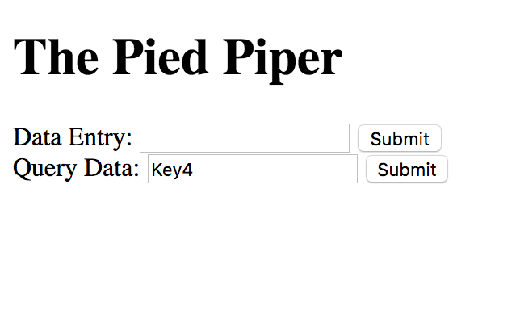

# The Pied Piper
A basic Express.js server that uses the socket.io library for communicating events to the client.

Clients are able to enter data to a database and query the data by providing key.

### Getting Started
Fork this repository, then clone your fork of this repository.

```
npm install
npm start
open http://localhost:8080
```
```
npm test to run test suite
npm run lint for linting of code
```
### Dependencies

* ExpressJS
* Socket.io

## Final Product



